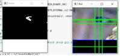

# 처음 하는 프로젝트 Eye Tracker 입니다.
설명        : 사용자로 부터 양안의의 좌표(x1, y1, x2, y2 데이터)를 가져와서, 실제 물체가 떨어진 거리 (z 데이터)를 선형회귀(최소제곱근사 least square estimation)합니다.  
description : Get Coordinate of two eyes(x1, y1, x2, y2) in picture, and linear regression to distance(z)  

 

### 사용법(Usage)
캠에다 얼굴을 비춰야합니다.  
이 때 동공보다 어두운 부분이 카메라에 들어가면 안 됩니다.  
(어두운 정도로 경계로 나눴기 때문이다.)  
또한 캠과 얼굴 사이의 간격이 일정해야 합니다.  
흔들림이 없어야 합니다  
얼굴에서 눈을 인식하여 좌표를 정확하게 따려면 더 좋은 화소의 카메라가 필요합니다. 

 

### 배운 점
ROI : region of interest  
Threashod : 경계값  
Contour : 윤곽선  
https://www.youtube.com/watch?v=kbdbZFT9NQI&t=657s  
해당 영상을 참고하여서 만들었습니다. 
더 많은 정보를 얻기 위해 영어를 더 열심히 해야겠습니다.  
training set이 매우 적었습니다. 
data를 직접 만들고 예측 모델을 만들어보는 값진 경험이었습니다. 
 

### 개선할 부분 분석
위 프로그램은 쥬피터 노트북 안에서 실행된다.  
UI가 필요하다. 또한 python이 깔리지 않은 컴퓨터에서도 실행되도록 exe 파일이 필요하다.  
얼굴 전체를 인식시켰을 때, 머리카락이 인식되는 오류가 발생했습니다.  
다음에 프로젝트를 진행한다면 GUI가 있고, 다른 오차가 발생해도 정확히 예측할 수 있는 모델을 만들어야겠습니다. 
